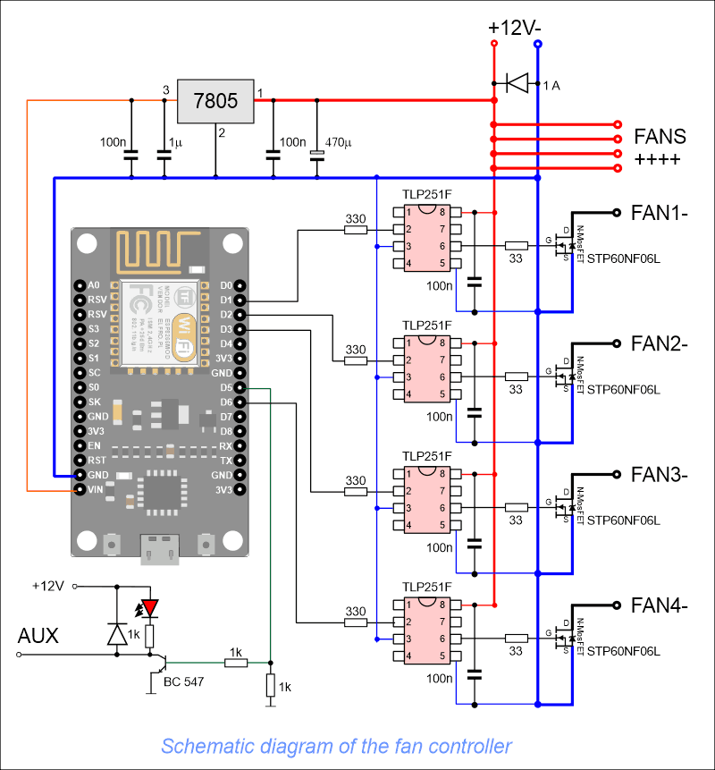
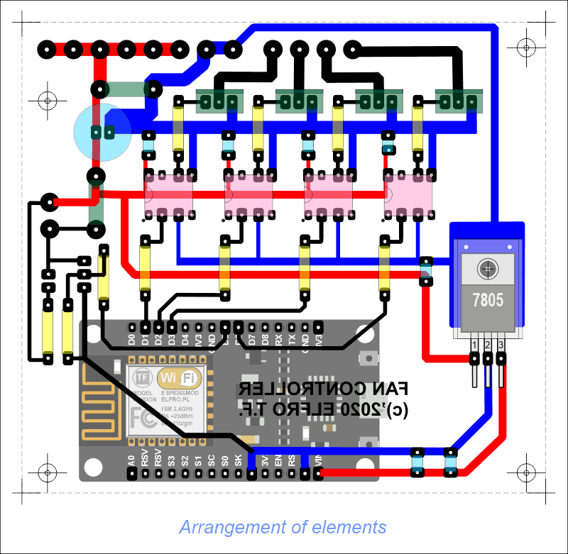

# ESP8266_FAN_Controller
An Arduino ESP8266 libraries and software to steering 4 PWMs ex. fans, motors, lights etc

Its simple software using Node MCU. User can connect by WiFi to local ESP Web Page and change values.
Software is available in english and polish language.

<h2> HARDWARE </h2> 

The D1-D4 outputs of the Node MCU board are configured as PWM in the project. PWM is pulse width modulation.

In ESP8266, the PWM module has 10 bits, so you can enter values from 0 for 0% to 1023 for 100%. Value 0 means no pulse, the fan is not working. Subsequent values increase the width of the pulse, and the larger it is, the faster the fan runs. for 1023 it is 100% and the fan is at maximum speed. ATTENTION. For very small values the fan may "not have enough power" to start!!! This can be solved programmatically, for example, give 50% for 0.5 seconds and then 5% - there are many solutions. In my solution, I used the ability to set the minimum speed and the Boost mode - acceleration to 50% for two seconds at the start of the fan.

Because ESP works with a voltage of 3.3V, each output can be set to a maximum of 3.3V and a current of several milliamps. This is not always sufficient to fully drive the power transistor. That's why I used the TLP251F driver to control the N-type MOSFET transistors. The use of the driver also solves a number of other problems widely described in many publications, so there is no point in writing here. It is better and easier to use a ready-made solution for PLN 2-3. By the way, it has galvanic separation. At high voltages (the system is easy to convert to 24.48 etc. volts) or currents and interference, it is worth considering separate power supply for the current part from the logic part. This solution makes it easy. The driver controls the MOSFET transistor, I used solid high-power transistors - this guarantees that they will not burn and there will be no need for a heat sink. Smaller (and less expensive) transistors can be used in various solutions.

I designed a PCB for this schematic. Basic assumption - ease of execution even for beginners. That's why I gave up on SMD components. The tile is quite large but easy to manufacture and assemble.

Arrangement of elements on the board:

Sources of schematics and board are in repository scheme folder

