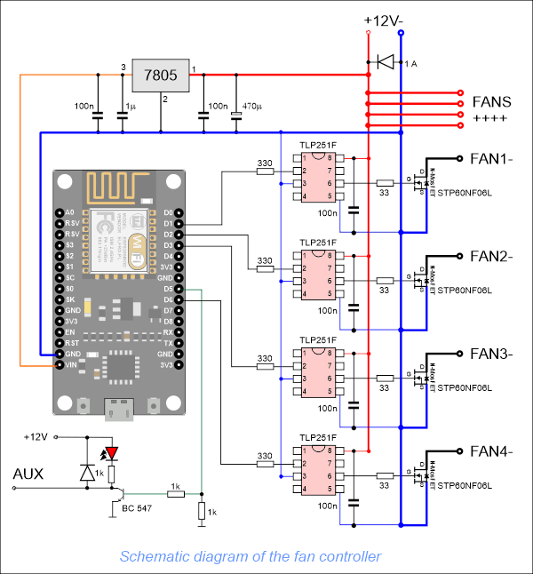

# ESP8266_FAN_Controller
An Arduino ESP8266 libraries and software to steering 4 PWMs ex. fans, motors, lights etc. (
(c)' 2020 ELFRO Tomasz Fronczek

Its simple software using Node MCU. User can connect by WiFi to local ESP Web Page and change values.
Software is available in english and polish language.

Its using Arduino libraries:

ESPAsyncTCP: https://github.com/me-no-dev/ESPAsyncTCP
ESPAsyncWebServer: https://github.com/me-no-dev/ESPAsyncWebServer
ArduinoJson: https://github.com/bblanchon/ArduinoJson 

AudrinoJson is used in 5th version - You can download older wersion or migrate code to newer (a little complicate)

<h2> HARDWARE </h2> 

The D1-D4 outputs of the Node MCU board are configured as PWM in the project. PWM is pulse width modulation.

In ESP8266, the PWM module has 10 bits, so you can enter values from 0 for 0% to 1023 for 100%. Value 0 means no pulse, the fan is not working. Subsequent values increase the width of the pulse, and the larger it is, the faster the fan runs. for 1023 it is 100% and the fan is at maximum speed. ATTENTION. For very small values the fan may "not have enough power" to start!!! This can be solved programmatically, for example, give 50% for 0.5 seconds and then 5% - there are many solutions. In my solution, I used the ability to set the minimum speed and the Boost mode - acceleration to 50% for two seconds at the start of the fan.

Because ESP works with a voltage of 3.3V, each output can be set to a maximum of 3.3V and a current of several milliamps. This is not always sufficient to fully drive the power transistor. That's why I used the TLP251F driver to control the N-type MOSFET transistors. The use of the driver also solves a number of other problems widely described in many publications, so there is no point in writing here. It is better and easier to use a ready-made solution for PLN 2-3. By the way, it has galvanic separation. At high voltages (the system is easy to convert to 24.48 etc. volts) or currents and interference, it is worth considering separate power supply for the current part from the logic part. This solution makes it easy. The driver controls the MOSFET transistor, I used solid high-power transistors - this guarantees that they will not burn and there will be no need for a heat sink. Smaller (and less expensive) transistors can be used in various solutions.

I designed a PCB for this schematic. Basic assumption - ease of execution even for beginners. That's why I gave up on SMD components. The tile is quite large but easy to manufacture and assemble.

Arrangement of elements on the board: 

 

Sources of schemat and board are in repository scheme folder

<h2>SOFTWARE</h2>

Every configuration is in inits.h file its simple and easy 
You can change language (English or Polish) if You don't need more languages Remove <code>String lang="/en";</code> and all its occurrences in the program.
You can also delete en and pl subfolders (in data folder)

Software is very simple. 
If the configuration of the device was not performed or it cannot connect to the selected WiFi network for more than a minute, the device will enter the Access Point mode where you can enter the configuration by connecting to the network called FAN_CONTROLLER, e.g. using a phone.

Password is not required. Connecting to the network and entering the Access Point mode is performed only at the start of the device !!!.

After connecting to Access Point mode, the device address will always be: 192.168.4.1
Software have four pages availabe in right top menu 
Main Page (Home)
About (info about program)
Fan config (confirgure PWM's)
Sys config (Configure Wifi Acces Control etc.)

First we need configure WiFi etc.  Strongly recommended its used static IP adresses.
 
 

Second after change data and reebot You can connect to device by entering the ip address into the web browser.
Then You can see Home (index.html) page: 
 

Fan config its used to configure fans and AUX 
 
 

That's all folks ;) 

(c)'2020 ELFRO Tomasz Fronczek

